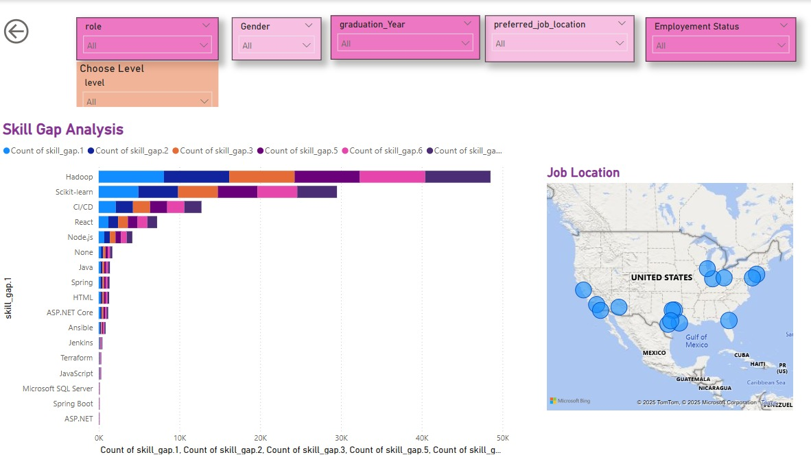

# Graduate Career Recommendation System 
A project to enhance job readiness by matching graduate skills with job market demands.
## Project Description

The Graduate Career Recommendation System is a data-driven solution aimed at helping students identify the most suitable job roles based on their current skill sets and preferences.

This system analyzes:
- Technical and soft skills provided by the student
- Preferred job location
- Existing skills

Based on this analysis, the system:
- Recommends job roles that best match the student’s profile
- Analyses the skill_Gap for the role they get match
- Offers insights and recommendations to help student
## 📚 Table of Contents

- [Project Description](#project-description)
- [Installation](#installation)
- [Usage](#usage)
- [Features](#features)
- [Power BI Dashboard](#power-bi-dashboard)
- [Contributing](#contributing)
- [License](#license)
- [Acknowledgements](#acknowledgements)
## Installation

To run or explore this project locally, follow these simple steps:

1. **Download the Power BI dashboard file**  
   - File name: `MRP_final(2).pbix`  
   - You can find it in the main repository folder

2. **Install Power BI Desktop**  
   - Download from: [https://powerbi.microsoft.com/desktop](https://powerbi.microsoft.com/desktop)

3. **Open the `.pbix` file in Power BI Desktop**

4. Explore the dashboard using available filters:
   - Select the skills you know
   - Select the skills to learn
   - State
   - Company
   - Role
##  Usage

To use the Power BI dashboard:

1. **Open the `MRP.pbix` file** using Power BI Desktop  
   (Download Power BI: https://powerbi.microsoft.com/desktop)

2. **Use the filters at the top** to interact with the data:
   - Select the skills you know
   - Select the skills to learn
   - State
   - Company
   - Role

3. Explore the visuals:
   - Employment by job role (bar chart)
   - Career level distribution (pie chart)
   - Employment trends over time (line graph)
   - Average computer skill scores
   - Total employed people count

## Features

🔄 **Interactive filtering** across all tabs.
- 🎯 **Personalized role suggestions** based on input skills.
- 🎓 **Course recommendations** with direct links and effort breakdown.
- 🌎 **Job insights** segmented by geography and employer.
- 📈 **Visualizations** for skill difficulty, effort per week, and market trends.

## Power BI Dashboard

This dashboard visualizes graduate employment insights using filters like role, gender, graduation year, preferred job location, and employment status.

It helps identify:
- Top job roles by employment
- Career levels of graduates (Entry, Associate, Mid)
- Trends in employment over the years
- Average computer skills scores
## Dashboard Preview
Below is a snapshot of the dashboard created in Power BI to analyze graduate career recommendations:

## Contributing

We welcome contributions from team members and collaborators!

If you'd like to improve this project, feel free to:

- Fork the repository
- Create a new branch
- Make your changes
- Submit a pull request (PR)

For major changes, please open an issue first to discuss your ideas.
## License

This project is licensed under the [MIT License](LICENSE).

That means it’s open to the public — anyone can view, use, modify, and share the project for personal or academic use.
## Acknowledgements

We would like to thank our professor for guiding us through this project.

Special thanks to:
- Our team members for their support and collaboration
- Power BI, Visual studio and Git for the tools used to build this project

