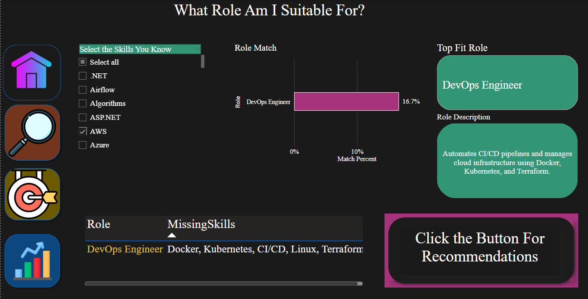
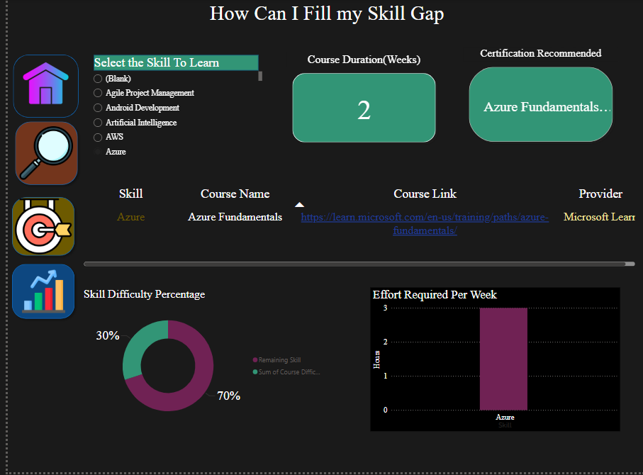

# Skill-Set Match - Career Recommendation System 
A project compares a user's current skills with the requirements of various job roles.
## Project Description

SkillMatchSet is a data-driven dashboard designed to help students and job seekers identify the most suitable job roles based on their current skills, learning preferences, and career goals.

This system analyzes:
- Technical skills provided by the student
- Preferred job location
- iMssing skills relevant to job roles

Based on this analysis, the system:
- Recommends top-matching job roles based on skill alignment
- Identifies specific skill gaps for each matched role
- Suggests personalized courses to bridge those gaps
- Provides job market insights including hiring companies, salary range, and demand trends
## 📚 Table of Contents

- [Project Description](#project-description)
- [Installation](#installation)
- [Usage](#usage)
- [Features](#features)
- [Power BI Dashboard](#power-bi-dashboard)
- [Contributing](#contributing)
- [License](#license)
- [Acknowledgements](#acknowledgements)
## Installation

To run or explore this project locally, follow these simple steps:

1. **Download the Power BI dashboard file**  
   - File name: `MRP_final(2).pbix`  
   - You can find it in the main repository folder

2. **Install Power BI Desktop**  
   - Download from: [https://powerbi.microsoft.com/desktop](https://powerbi.microsoft.com/desktop)

3. **Open the `.pbix` file in Power BI Desktop**

4. Explore the dashboard using available filters:
   - Select the skills you know
   - Select the skills to learn
   - State
   - Company
   - Role
##  Usage

To use the Power BI dashboard:

1. **Open the `MRP.pbix` file** using Power BI Desktop  
   (Download Power BI: https://powerbi.microsoft.com/desktop)

2. **Use the filters at the top** to interact with the data:
   - Select the skills you know
   - Select the skills to learn
   - State
   - Company
   - Role

3. **Explore the visuals:**
   
- Displays suitable job roles based on skill overlap.
-	Course duration in weeks.(card)
-	Effort required per week.(Bargraph)
-	Skill difficulty percentage (e.g., Remaining vs. Covered).
-	Heatmap of job availability by state.
-	Bar chart of open roles in selected region.
-	Pie chart showing hiring companies.
-	Line chart for salary ranges by role.
-	Horizontal bar chart of Top 5 In-Demand Roles
-	Vertical bar chart showing Top 5 Skills to Learn
-	Pie chart of Top Hiring Companies

## Features

🔄 **Interactive filtering** across all tabs.
- 🎯 **Personalized role suggestions** based on input skills.
- 🎓 **Course recommendations** with direct links and effort breakdown.
- 🌎 **Job insights** segmented by geography and employer.
- 📈 **Visualizations** for skill difficulty, effort per week, and market trends.

## Power BI Dashboard

This dashboard visualizes graduate employment insights using filters like role, gender, graduation year, preferred job location, and employment status.

It helps identify:
- Top job roles by employment
- Career levels of graduates (Entry, Associate, Mid)
- Trends in employment over the years
- Average computer skills scores
## Dashboard Preview
Below is a snapshot of the dashboard created in Power BI to analyze graduate career recommendations:
Brief overview of the dashboard purpose.
- Guidance on navigating the tool.
- Explanation of key components like skill assessment, gap identification, and job insights.

**Skill Match**
- Allows users to select their known skills.
- Displays suitable job roles based on skill overlap.
- Shows a match percentage and highlights any missing skills for those roles.

**Skill Gap**
- Users can select a missing skill to view recommended learning resources.
- Displays:
  - Course duration in weeks.
  - Effort required per week.
  - Course link and provider.
  - Skill difficulty percentage (e.g., Remaining vs. Covered).
  - Suggested certification if available.

**Job Market**

  - State/Region
  - Company
  - Role
- Visuals include:
  - Total job postings.
  - Heatmap of job availability by state.
  - Bar chart of open roles in selected region.
  - Pie chart showing hiring companies.
  - Line chart for salary ranges by role.

**Overall Analysis**
- Horizontal bar chart of Top 5 In-Demand Roles
- Vertical bar chart showing Top 5 Skills to Learn
- Pie chart of Top Hiring Companies
- Insight text block summarizing market demand and skill recommendations

**Conclusion**
- Helps users find the right job roles based on their skills.
  

## Contributing

We welcome contributions from team members and collaborators!

If you'd like to improve this project, feel free to:

- Fork the repository
- Create a new branch
- Make your changes
- Submit a pull request (PR)

For major changes, please open an issue first to discuss your ideas.
## License

This project uses the **Software Engineer Jobs & Salaries 2024** dataset, provided by Emre Öksüz on Kaggle.
- 📁 Dataset Source: [Kaggle - Software Engineer Jobs & Salaries 2024](https://www.kaggle.com/datasets/emreksz/software-engineer-jobs-salaries-2024)
- 📝 License: [Apache License 2.0](https://www.apache.org/licenses/LICENSE-2.0)

That means it’s open to the public — anyone can view, use, modify, and share the project for personal or academic use.

## Acknowledgements

We would like to thank our professor for guiding us through this project.

Special thanks to:
- Our team members for their support and collaboration
- Power BI, Visual studio and Git for the tools used to build this project

